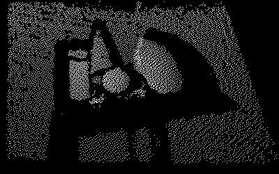
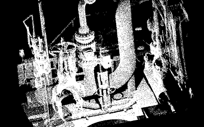
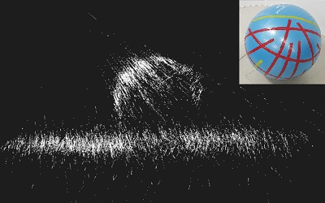

# XYZ test binaries for FindSurfaceWeb-WebDemo

## Overview

These files are provided for testing [FindSurfaceWeb-WebDemo](../README.md).

## [sample.xyz](sample.xyz)

This pointcloud represents a scene in which simple shapes are laid against a plane.

The following parameters are recommended:
- Accuracy: 0.003
- Mean Distance: 0.006
- Touch Radius: 0.05
- Radial Expansion: 5 (default)
- Lateral Extension: 10 (radical growing)

## [LFM_500K.xyz](LFM_500K.xyz)

This pointcloud represents a factory with a complex pipework.

The following parameters are recommended:
- Accuracy: 0.003
- Mean Distance: 0.01
- Touch Radius: 0.2
- Radial Expansion: 5 (default)
- Lateral Extension: 5 (default)

## [Gym_Ball_iPad_1.xyz](Gym_Ball_iPad_1.xyz)

This pointcloud represents a gym ball on the floor scanned using ARKit.

The following parameters are recommended:
- Accuracy: 0.04
- Mean Distance: 0.05
- Touch Radius: 0.4
- Radial Expansion: 5 (default)
- Lateral Extension: 5 (default)
